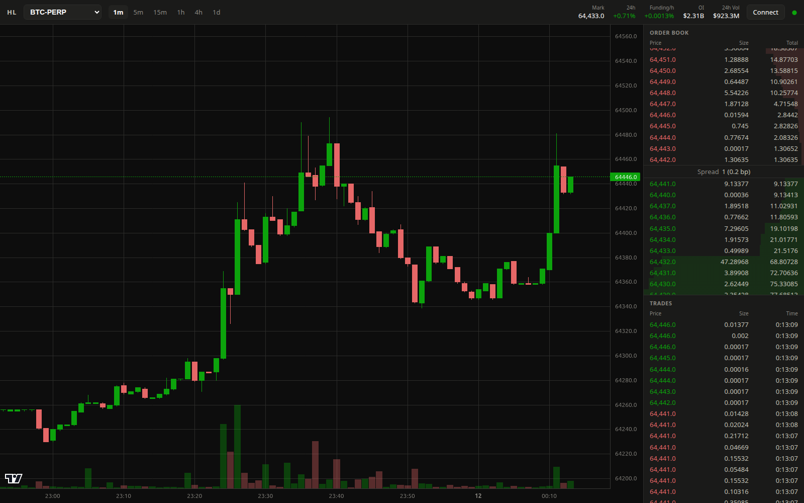

# HL Terminal

[Hyperliquid](https://hyperliquid.xyz) の自作 Web フロントエンド。公開 API（REST + WebSocket）を
ブラウザから直接叩く、ビルド不要の静的ファイル構成。バックエンドなし・API キー不要。



## 機能

- ローソク足チャート（1m〜1d、出来高付き、最新足に自動追従）— lightweight-charts
- リアルタイム板（累積深度バー・スプレッド表示）/ 約定履歴 / Mark・Funding・OI 等のステータス
- 全 PERP 銘柄を出来高順で切替
- ウォレット接続（MetaMask SDK）: ブラウザ拡張、またはQRをスマホの MetaMask で承認
  - 接続後、資産・ポジション・オープン注文を表示（読み取り専用。署名・発注機能はなし）
  - アドレス手入力のウォッチモードあり（`?user=0x…` でも可）

## 使い方

```sh
./build-sdk.sh   # 初回のみ: metamask-sdk.bundle.js を生成（npm が必要）
./run.sh [port]  # デフォルト 8010
```

ブラウザで `http://<ホスト>:8010/` を開く。

MetaMask SDK のバンドルは ConsenSys の独自ライセンス（再配布不可）のため
リポジトリに含めていません。`build-sdk.sh` が npm から取得して生成します。

## 注意

- 本ソフトウェアは非公式の個人プロジェクトであり、Hyperliquid とは無関係です。
- 表示される情報の正確性は保証しません。投資判断は自己責任で。
